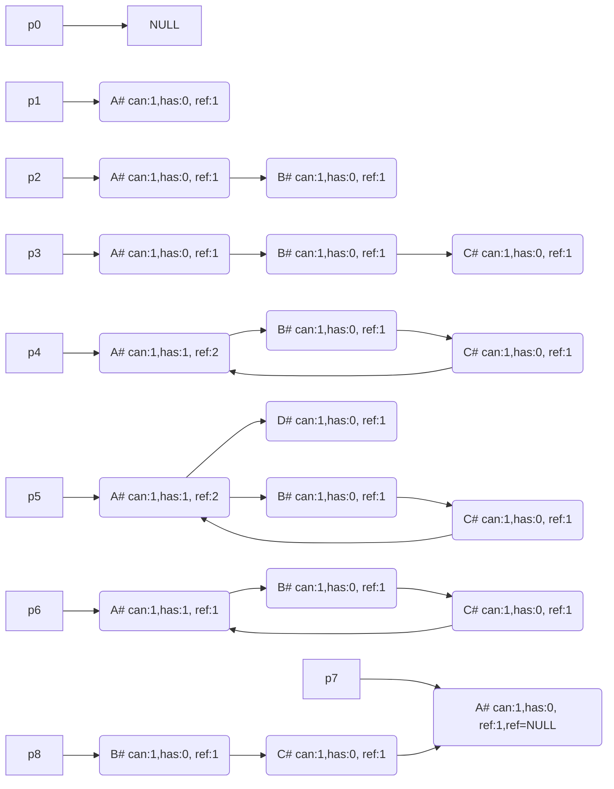

## 简介
RapC,是一种能够翻译成C语言的高级语言易用性内存安全的语言。并且支持继承，重载，重写，接口，泛型，lambda表达式，mixin，内置正则表达式。

### 1. 函数就是闭包，分为有名函数和无名函数

function_name(arg1:<T1:int2,int4>,arg2:int4):<R:int2,int4,int7> {body}

### 2. 基本数据类型，bool，char，int， float，int，float是自定义长度数据类型

### 3. 自定义类型
package rp.utils;

import {Meta} rp.meta;
import {std} rp.c.std;

writeable|readable deed|class TypeName <T:int2,int4;R:string,char,…> :supertype,interfaceA,…{
	readable name:R;
	writeable brithday:T;
	callable age():R{};
	init(){}
}

### 4. 条件编译， 条件编译只能作用在契约上并且是文件级别的。

### 5. 有元组概念，可多返回值 let val<i8,u8> = [1,2];

### 6. 内存问题 堆、栈。
数据生命周期与函数栈生命周期相同。从main函数开始到
a. 函数栈数据与堆数据
i. 静态空间申请在函数栈中，被返回的对象，由调用者申请。
ii.变长数据在堆中，该数据一定是集合内的数据。所有者是集合对象的所有者

b. 数据引用、环形引用和释放。
   定理：正常执行过程中引用环一定产生在引用计数值不小于2处。
   引用计数&环形标记，编译器通过类型标注是否可能存在环形引用，如果不存在环形引用则直接释放，如果存在环形引用引用值为1的时候。
 检查所有引用环是否都为1。
```c
typedef struct Obj;

struct Obj {
char name[20],
Obj *ref;
}

void fn() {
Obj* p = NULL;
Obj a=new Obj("A");
p=&a;
free(a);
Obj b = new Obj("B");
a.ref = &b;
free(b);
Object c = new Obj("C");
b.ref = &c;
c.ref = p;
free(c);
Obj d = new Obj("D");
d.ref = p;
free(d);
free(p)
}

```



### 7. gui编程

### 8. gcc源码

### 9. 包装C程序，将C程序函数库封装成RapC便于使用。并工具支持将.h文件转换成.rp文件。


### 10. rp语法结构
包名
包注释
应用列表
类注释
类定义
成员注释
成员
函数注释
函数说明

any 用于透传翻译, 保留C语言预编译,如: #ifdef #endif #ifndef #define 等保留


